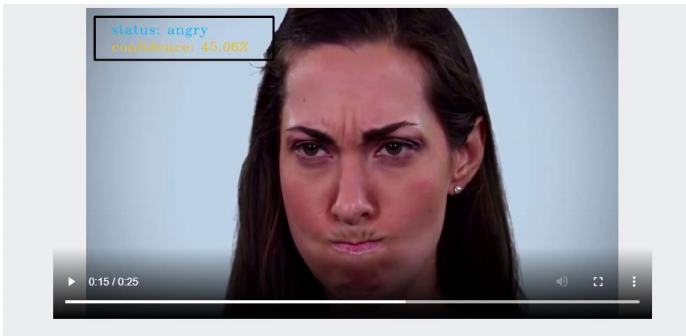
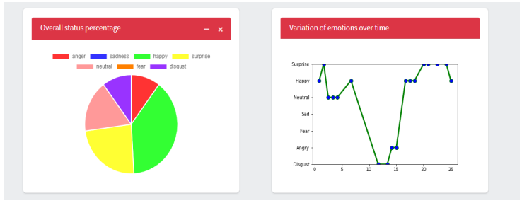

Since customers express their thoughts and feelings more openly than ever
before, Emotion analysis is becoming an essential to monitor and understand
these emotions. Automatically analyzing customer feedback, such as opinions in
survey responses, product reviews and social media posts, comments, videos, and
conversations, allows brands and service providers to learn what makes customers
happy or frustrated, so that they can tailor products and services to meet their
customers’ needs.

Therefor this project aims to automate the process of analyzing people opinion
and feedback from videos, the project applies Artificial intelligence techniques
in classifying the expressed emotions (anger, fear, disgust, happy, neutral, sad
and surprise) and provide detailed description of their emotional status which
is of great interest to all brands and all service providers to get the real
feedback about their services and to improve it.

 

Emotion state report

 

 

When we started this project, we had main goal to achieve high accuracy and to
apply FER models to the real world. We explored several models including shallow
CNNs and pretrained networks based on VGG16. To alleviate FER2013’s inherent
class imbalance, we employed data augmentation. By applying pre trained Deep
face VGG16 we achieved 71.2 accuracy, which is close to the highest accuracyto
our knowledge. We also found through network interpretability that our models
learned to focus on relevant facial features for emotion detection.
Additionally, we demonstrated that FER models could be applied in the real world
by developing a web application that allow user to upload his videos and then
these videos are analyzed and provide him with different statistics based on
facial expression recognition.
